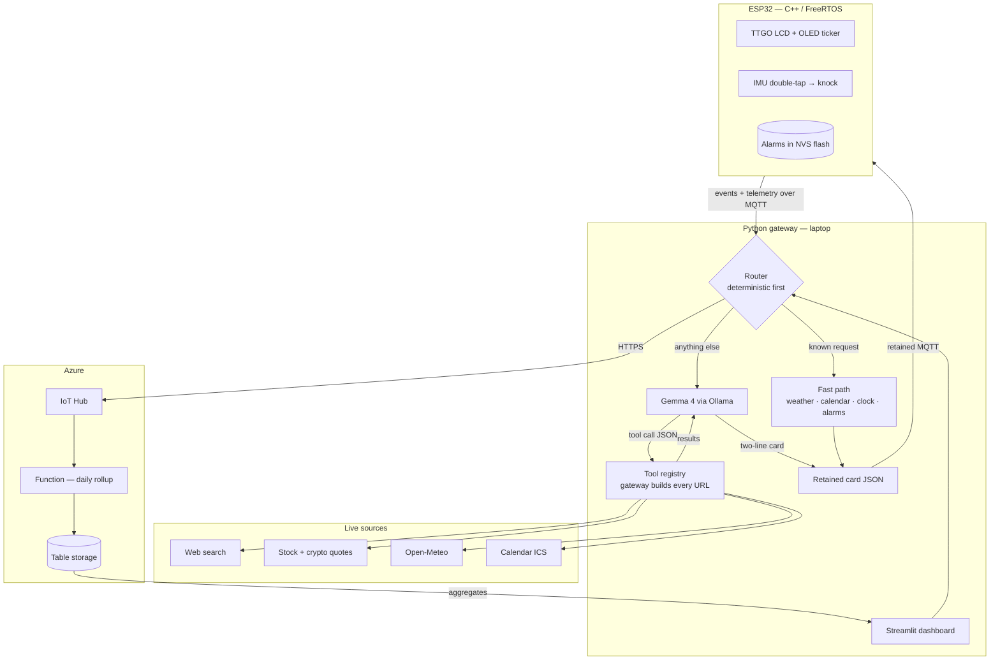

# Briefly

A private briefing station for your desk or nightstand. It shows the weather, your next calendar event, and any topic you name in plain English. Tell it you care about the Steelers and SpaceX stock and it works out where to look, in real time.

It is also a reliable alarm clock. Knock twice on the case to snooze. The clock and alarm keep working when the laptop is closed.

<!-- TODO: add a photo or short GIF of the device here. A real photo is the single highest value addition to this README. -->

## Why

Checking the weather, your calendar, and the news takes ten seconds. Doing it on a phone takes ten minutes, because every unlock invites notifications and feeds. Smart displays solve this but introduce an always listening microphone and send every request to a vendor's cloud.

Briefly is the middle path. Glanceable information on dedicated hardware, personalized in plain English, with the language model running locally through Ollama. There is no microphone, no vendor account, and no cloud inference: the model reasoning about your day runs on hardware you own. When a topic needs current information the gateway makes an anonymous public API call, and nothing else leaves the network.

## Architecture

Three tiers. An ESP32 renders and reacts, a Python gateway thinks, and Azure stores and aggregates.



The device and gateway talk over MQTT through a local Mosquitto broker with username and password authentication. The gateway publishes retained card messages, so the device recovers its display automatically after either side restarts.

## How a card is built

1. A request arrives: a scheduled refresh, a knock on the case, or a line of chat.
2. The router checks the deterministic fast path first. Weather, calendar, clock, alarms, and a short table of common topics are handled entirely in code, with no model call.
3. Anything else goes to Gemma, which fetches nothing itself. It emits a structured tool call, a tool name and arguments, and the gateway validates both against a schema before executing.
4. Results return to Gemma, which condenses them into two lines of at most 21 characters and returns JSON constrained output.
5. The gateway publishes the card as a retained MQTT message. The device renders it across the color LCD and the OLED ticker. Cards refresh every 15 minutes or on demand.

## Design decisions

**The model chooses tools, never URLs.** Asked to add a topic, a language model will confidently produce a plausible feed URL that returns 404. An earlier version solved that by constraining the model to a fixed list of sources, which capped the product at whatever had been typed into that file. Tool calling keeps the safety property without the cap: Gemma emits a tool name and arguments, the gateway validates both and builds the request itself. New capability means adding a tool, not widening a whitelist.

**The language model is never in the path of a critical command.** Model output varies for identical input, so the commands people use most are handled deterministically in code. The word `update` is a hard coded trigger. Alarm phrases are matched by pattern first. Only free form text reaches the model. The feature that feels most intelligent needed the least model involvement.

**Every model path has a deterministic fallback.** Each call is bounded by a timeout, and each result is parsed defensively. If Gemma is slow, absent, or returns something unparseable, the gateway formats the raw tool result itself and still publishes a card. The system degrades in quality rather than failing.

**The device degrades instead of breaking.** Alarms persist in on chip NVS flash and time comes from NTP, so the clock and alarm subsystem never depend on the gateway. Close the laptop and Briefly is still an alarm clock. Open it and retained MQTT messages restore the cards without user action.

**Firmware is organized as FreeRTOS tasks.** Networking, display, input, and timekeeping run as separate tasks so a slow network call cannot stall the display or delay an alarm.

**Transport, model, tools, and sources are separate modules.** Each can be exercised independently, which makes the whole gateway testable with no hardware attached. A virtual device in `tools/` speaks the same MQTT protocol as the firmware, so both halves of the team can work in parallel.

## Repository layout

```
firmware/          C++ / Arduino / PlatformIO. FreeRTOS tasks, display, alarm, NVS persistence.
gateway/
  service.py       Always on: refresh loop, MQTT wiring, Azure forwarding.
  app.py           Streamlit dashboard: cards, chat router, analytics, settings.
  brain.py         Tool-calling loop, card writing, preference parsing.
  tools.py         Tool registry, argument schemas, validation, TTL cache.
  fetchers.py      Web search, quotes, weather, geocoding, calendar, RSS.
  catalog.py       Fast-path table for common topics.
  mqtt_link.py     Publish and subscribe, retained card handling.
  cloud.py         Azure IoT Hub forwarding.
tools/
  virtual_device.py   Full device simulator. No hardware required.
  publish_test_card.py
azure/             Azure Function for daily aggregates.
mosquitto/         Broker config.
```

## Running the gateway

Requirements: Python 3.11 or newer, a local Mosquitto broker, and [Ollama](https://ollama.com) with a Gemma model pulled.

```bash
git clone https://github.com/bvazrala/<REPO_NAME>.git
cd <REPO_NAME>

cd mosquitto
mosquitto_passwd -c passwd stationuser
chmod 644 passwd
mosquitto -c mosquitto.conf -v
```

In a second terminal:

```bash
cd gateway
python3 -m venv .venv && source .venv/bin/activate
pip install -r requirements.txt
cp secrets.example.json secrets.json    # then fill in the broker password
python service.py
```

In a third:

```bash
cd gateway && source .venv/bin/activate
streamlit run app.py
```

The dashboard starts at `http://localhost:8501`. Set interests in plain English, for example `I care about the Steelers and SpaceX stock`. Type `update` to refresh every card.

For the local model:

```bash
ollama pull <MODEL_TAG>      # confirm the exact tag with: ollama list
```

Then enable Gemma in the dashboard's Settings tab. Weather, calendar, alarms, and fast-path topics all work without it.

## Running without hardware

`tools/virtual_device.py` speaks the same MQTT protocol as the firmware and draws both screens as ASCII.

```bash
source gateway/.venv/bin/activate
python tools/virtual_device.py
```

Commands: `knock`, `update`, `next`, `dismiss`, `ring`, `temp`, `quit`.

## Firmware

Built with PlatformIO against the Arduino framework. Copy `include/secrets_example.h` to `include/secrets.h` and fill in Wi-Fi and broker credentials first.

```bash
cd firmware
pio run -t upload
pio device monitor
```

## Hardware

| Component | Qty |
| --- | --- |
| LILYGO TTGO ESP32 with built in LCD | 1 |
| SSD1306 OLED 128x64 | 1 |
| CAP1188 capacitive touch breakout | 1 |
| LSM6DSO accelerometer and gyroscope | 1 |
| DHT20 temperature and humidity sensor | 1 |
| Piezo buzzer | 1 |
| LEDs with resistors | 3 |
| Pushbuttons | 2 |
| Breadboard, jumper wires, headers | 1 |

A host laptop runs the gateway and the local model.

## Status

<!-- TODO: update as milestones land. -->

- [x] Hardware bring up. I2C bus scan, both displays drawing, NTP clock running.
- [x] MQTT round trip with retained cards rendering on device.
- [x] Standalone alarm with double knock snooze.
- [x] Gateway end to end: live sources, retained cards, dashboard, virtual device.
- [ ] Tool calling against a running Ollama instance.
- [ ] Azure ingestion and the analytics dashboard.
- [ ] Enclosure and final demo.

Planned evaluation: the fraction of well formed cards Gemma produces across a week of real use, and a comparison of card quality and latency between the E4B and 12B model sizes.

## Contributions

This is a two person project. I am the team lead and wrote all of the software: the firmware, the gateway, the tool calling layer, the MQTT transport, and the dashboard. My teammate handles hardware assembly and on device testing.

## License

<!-- TODO: pick one. MIT is the usual default. -->
