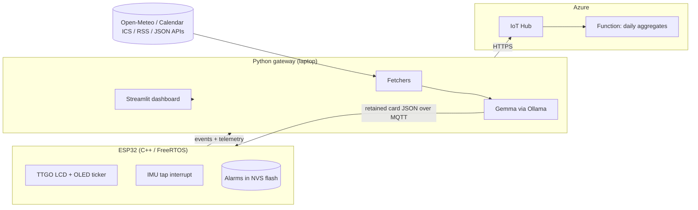

# Briefly

A private briefing station for your desk or nightstand. It shows the weather, your next calendar event, headlines, and any topic you care about. Every request is interpreted by a language model running on your own machine, so nothing you ask about leaves your network.

It is also a reliable alarm clock. Knock twice on the case to snooze. The clock and alarm keep working when the laptop is closed.

<!-- TODO: add a photo or short GIF of the device here. A real photo is the single highest value addition to this README. -->

## Why

Checking the weather, your calendar, and the news takes ten seconds. Doing it on a phone takes ten minutes, because every unlock invites notifications and feeds. Smart displays solve this but introduce an always listening microphone and send requests to a vendor's cloud.

Briefly is the middle path. Glanceable information on dedicated hardware, personalized in plain English, with the language model running locally through Ollama. No cloud inference and no always on microphone.

## Architecture

Three tiers. An ESP32 renders and reacts, a Python gateway thinks, and Azure stores and aggregates.



The device and gateway talk over MQTT through a local Mosquitto broker with username and password authentication. The gateway publishes retained card messages, so the device recovers its display automatically after either side restarts.

## How a card is built

1. A fetcher pulls a source on a schedule. Weather comes from Open-Meteo, events from a Google Calendar ICS feed, headlines from RSS, and custom topics from public JSON APIs.
2. The raw response goes to Gemma running locally through Ollama, with JSON constrained output, and comes back as two lines of at most 24 characters.
3. The gateway publishes the card as a retained MQTT message.
4. The device renders it across the color LCD and the OLED ticker. Cards refresh every 15 minutes or on demand.

## Design decisions

**The language model is never in the path of a critical command.** Model output varies for identical input, so the commands people use most are handled deterministically in code. The word `update` is a hard coded trigger. Alarm phrases are matched by pattern first. Only free form text reaches the model. The feature that feels most intelligent needed the least model involvement.

**The device degrades instead of breaking.** Alarms persist in on chip NVS flash and time comes from NTP, so the clock and alarm subsystem never depend on the gateway. Close the laptop and Briefly is still an alarm clock. Open it and retained MQTT messages restore the cards without user action.

**Firmware is organized as FreeRTOS tasks.** Networking, display, input, and timekeeping run as separate tasks so a slow network call cannot stall the display or delay an alarm.

**Transport, model, and sources are separate modules.** Each fetcher, the model adapter, and the MQTT layer can be exercised independently, which makes the gateway testable without any hardware attached.

## Repository layout

<!-- TODO: adjust to match your actual tree once the gateway refactor lands. -->

```
firmware/          C++ / Arduino / PlatformIO. FreeRTOS tasks, display, alarm, NVS persistence.
gateway/
  fetchers/        Weather, calendar, headlines, custom topics.
  llm/             Ollama adapter, JSON constrained card generation.
  mqtt/            Publish and subscribe, retained card handling.
  dashboard/       Streamlit chat and preference routing.
  tests/           pytest suite. No hardware required.
cloud/             Azure Function for daily aggregates.
docs/              Wiring photos, architecture figures.
```

## Running the gateway

<!-- TODO: verify these steps against your actual setup before submitting. -->

Requirements: Python 3.11 or newer, [Ollama](https://ollama.com) with a Gemma model pulled, and a local Mosquitto broker.

```bash
git clone https://github.com/bvazrala/<REPO_NAME>.git
cd <REPO_NAME>/gateway

python -m venv .venv && source .venv/bin/activate
pip install -r requirements.txt

cp .env.example .env      # then fill in broker credentials, calendar URL, Azure connection string
ollama pull <MODEL_TAG>

python -m gateway
```

Run the tests:

```bash
pytest
```

The Streamlit dashboard starts at `http://localhost:8501`. Set preferences in plain English, for example `I care about the Lakers and Bitcoin, skip politics`. Type `update` to refresh every card.

## Firmware

Built with PlatformIO against the Arduino framework.

```bash
cd firmware
pio run -t upload
pio device monitor
```

## Hardware

| Component | Qty |
| --- | --- |
| LILYGO TTGO ESP32 with built in LCD | 1 |
| SSD1306 OLED 128x64 | 1 |
| CAP1188 capacitive touch breakout | 1 |
| LSM6DSO accelerometer and gyroscope | 1 |
| DHT20 temperature and humidity sensor | 1 |
| Piezo buzzer | 1 |
| LEDs with resistors | 3 |
| Pushbuttons | 2 |
| Breadboard, jumper wires, headers | 1 |

A host laptop runs the gateway and the local model.

## Status

<!-- TODO: update as milestones land. -->

- [x] Hardware bring up. I2C bus scan, both displays drawing, NTP clock running.
- [x] MQTT round trip with retained cards rendering on device.
- [x] Standalone alarm with double knock snooze.
- [ ] End to end briefing loop with Azure ingestion.
- [ ] Headlines, custom topics, and the Azure analytics dashboard.
- [ ] Enclosure and final demo.

Planned evaluation: the fraction of well formed cards Gemma produces across a week of real use.

## Contributions

This is a two person project. I am the team lead and wrote all of the software: the firmware, the gateway, the model integration, the MQTT layer, and the dashboard. My teammate handles hardware assembly.

## License

<!-- TODO: pick one. MIT is the usual default. -->
